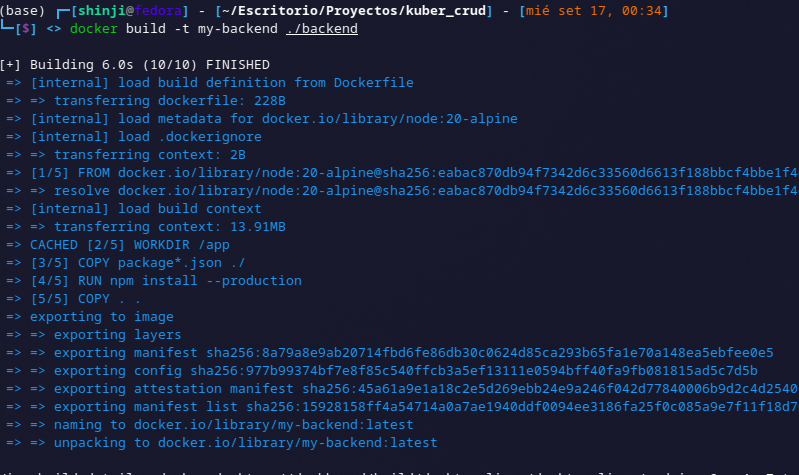
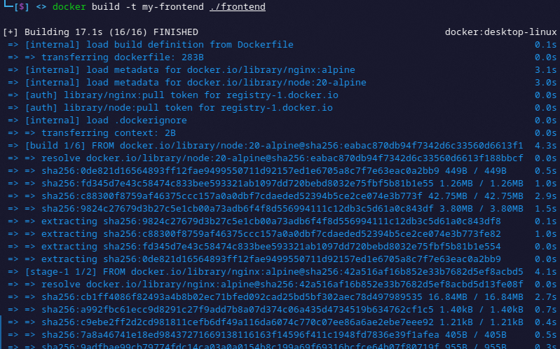
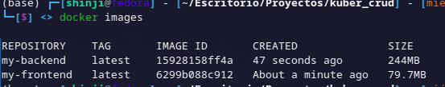
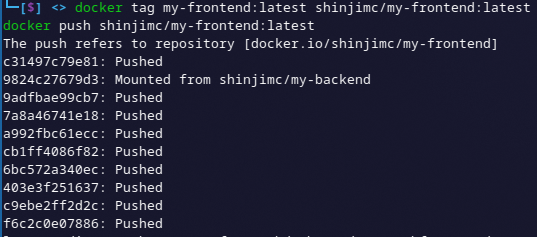
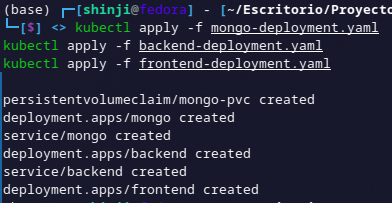
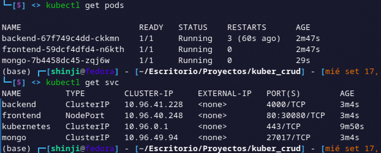
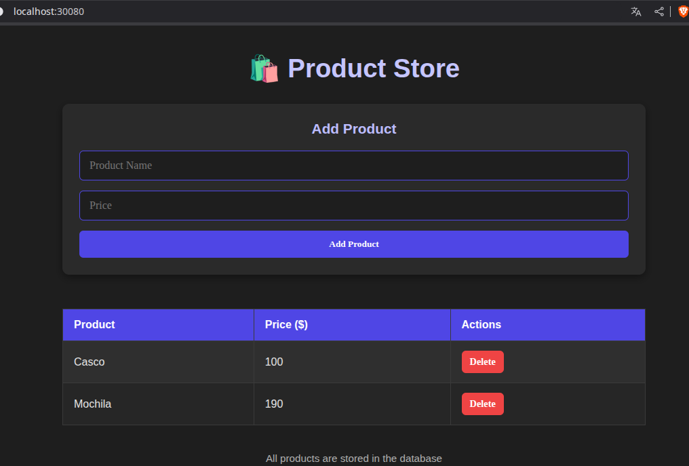

# CRUD de Productos

Este proyecto es un **CRUD de productos** que permite registrar productos con **nombre** y **precio**.
Se compone de:

- **Frontend:** React.js
- **Backend:** Node.js (Express)
- **Base de datos:** MongoDB

---

## Ejecución

Si quieres probar el software localmente antes de desplegarlo en Kubernetes:

### Frontend

```bash
cd frontend
npm install
npm run dev
```

Esto iniciará el frontend en modo desarrollo. Recuerda ajustar la URL del backend en `App.js` según donde esté corriendo tu API (por ejemplo `http://localhost:4000/items`).

### Backend

```bash
cd backend
npm install
npm run start
```

Esto iniciará el backend en el puerto 4000 por defecto y conectará con MongoDB según la variable de entorno `MONGO_URI`.

---

## Despliegue mediante Kubernetes

### 1. Construcción de imágenes Docker

- Antes de desplegar en Kubernetes, construye las imágenes Docker de tu frontend y backend:

```bash
docker build -t my-backend ./backend
```



```bash
docker build -t my-frontend ./frontend
```



- Verifica que las imágenes se hayan creado correctamente:

```bash
docker images
```



- Si vas a usar un cluster remoto con **kubeadm** o cualquier otro cluster que no tenga acceso a tus imágenes locales, etiqueta y sube la imagen del backend a Docker Hub:

```bash
docker tag my-backend:latest <user>/my-backend:latest
docker push <user>/my-backend:latest
docker tag my-backend:latest <user>/my-frontend:latest
docker push <user>/my-frontend:latest
```



### 2. Despliegue en Kubernetes

Todos los archivos de configuración YAML se encuentran en la carpeta `k8s/`.

#### a) Aplicar los deployments y servicios

```bash
kubectl apply -f k8s/mongo-deployment.yaml
kubectl apply -f k8s/backend-deployment.yaml
kubectl apply -f k8s/frontend-deployment.yaml
```



#### b) Verificar el estado de los pods y servicios

```bash
kubectl get pods
kubectl get svc
```



### 3. Acceso a la aplicación

La página web estará disponible a través del servicio de Kubernetes.
Dependiendo de tu configuración, se podrá acceder mediante **NodePort** o **LoadBalancer**.
Podrás interactuar con el CRUD de productos desde tu navegador:



---

## Author

- **ShinjiMC** - [GitHub Profile](https://github.com/ShinjiMC)

## License

This project is licensed under the MIT License. See the [LICENSE](LICENSE) file for details.
